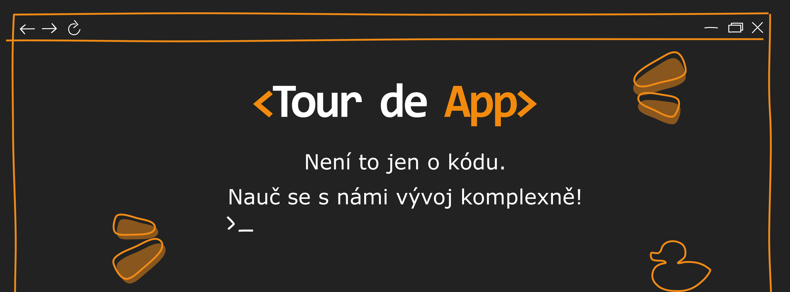
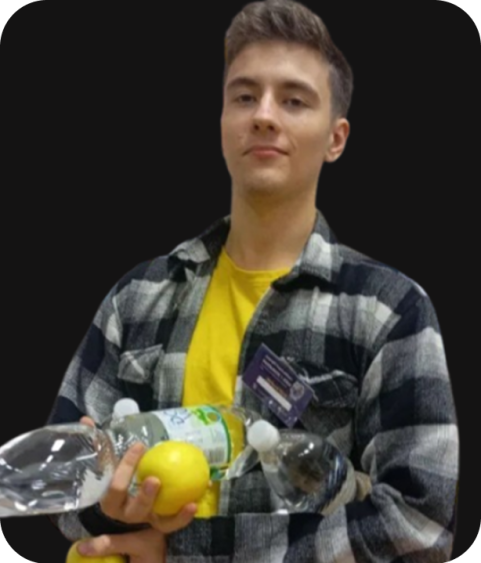
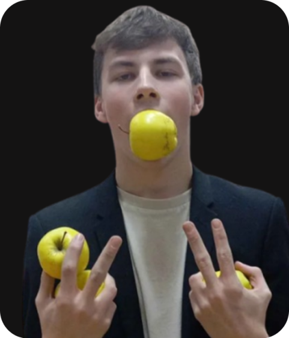

# PREZZ


Richard Hývl|Ondřej Kučera|Petr Machovec
:-------------------------:|:-------------------------:|:-------------------------:
|| 
Back-endový Mág|Seamus Finnigan Back-endu 🧙🏻‍♂️|Front-end Boss
Vášnivý Šachysta|Dancer 💃🕺 |Milovník rapu
Banik pyco|Poslouchá Jazz WTF|Sigma

## 🛠️ Technologie


## 🏃 Lokální spuštění
Naklonujte repozitář z GitHub a ve složce otevřete terminál.
Je žádoucí mít nainstalován potřebný software.

### 1. Software
#### Windows
- [WSL2 (Windows Subsystem for Linux)](https://learn.microsoft.com/en-us/windows/wsl/install)
- [Docker](https://www.docker.com/)

#### Linux
- [Docker](https://www.docker.com/)

#### Mac
- [Docker](https://www.docker.com/)

### 2. Příkaz do terminálu
```
docker build . -t tda-laravel
docker run -p 8080:80 tda-laravel
```
### 3. Otevřít localhost
Přejdi na adresu [http://localhost:8080](http://localhost:8080)

## ✍️🔥 PREZZ Lore
Ahoj! Jsme skupina zatím 3 programátorů z druhého a třetího ročníku ze [SPŠE a VOŠ Pardubice](https://www.spse.cz/), která se náhodou setkala na Re-power your future (ekonomická soutěž v Hradci Králové) a dala do kupy při Hackathonu AstroPI, který jsme výhráli v děsném znevýhodnění proti větším a zkušenějším skupinám. Po tomto neskutečným úspěchu jsme se dali dohromady a vytvořili skupinu PREZZ. Naším cílem je vybudovat si jméno soutěžemi, projekty pro klienty a všemi ostatními příležitostmi.
